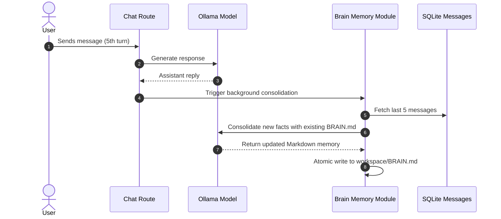

# Brain Memory

Marnie features an automatic, persistent, long-term memory system stored in `workspace/BRAIN.md`. This system allows the AI assistant to remember facts about the user, their technical preferences, ongoing projects, and critical directives across different conversations.

---

## 1. How It Works

1. **Storage**: All memory is stored as human-readable Markdown in `workspace/BRAIN.md`.
2. **Prompt Injection**: The entire contents of `BRAIN.md` are dynamically injected into the system prompt of every standard chat session, giving the assistant continuous awareness of past context.
3. **Background Consolidation**:
   - Every **5 conversation messages** (configurable via the Settings panel), the backend triggers an automated consolidation task (`consolidateMemory()`).
   - The system retrieves recent turns, strips internal thoughts and tool calls, and invokes the local LLM with a dedicated consolidation prompt.
   - The LLM merges newly learned facts into existing sections (such as User Profile, Active Projects, Preferences, Technical Constraints) and writes the consolidated summary back to `workspace/BRAIN.md`.
4. **Manual & Tool Control**:
   - Users can directly view and edit `BRAIN.md` through the Artifacts/File panel.
   - The AI agent can explicitly read or update its memory at any time using the `read_brain_memory` and `update_brain_memory` tools.



---

## 2. Default Structure of `BRAIN.md`

When initialized, `workspace/BRAIN.md` contains structured categories:

```markdown
# User Memory & Context

## User Profile
- Name / Preferred Identity:
- Timezone / Location:

## System & Environment
- Primary OS: Linux
- Default Shell: Bash
- Core Languages: JavaScript, Python, Bash

## Preferences & Directives
- Coding Style: Clean, modular, well-commented
- Communication Tone: Concise, authoritative, professional, no emojis

## Active Projects & Goals
- Marnie: Local AI workspace development
```

---

## 3. Configuration & API Endpoints

- `GET /api/brain`: Returns the current markdown content of `workspace/BRAIN.md`.
- `PUT /api/brain`: Manually overwrites `workspace/BRAIN.md` with new markdown content.
- `POST /api/brain/consolidate`: Immediately triggers an LLM consolidation cycle using the recent conversation context.
- `PATCH /api/brain/settings`: Updates consolidation interval thresholds (default: every 5 messages).
