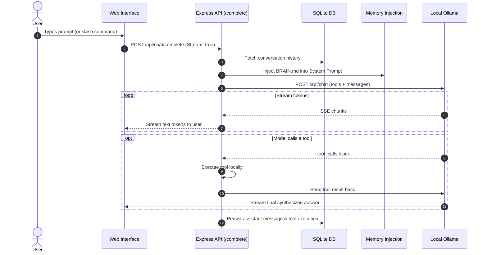

# Chat, Completions & Slash Commands

The conversational core of Marnie enables streaming chat interactions with local Ollama models, tool execution handling, branch forking, history search, and slash command automations.

---

## 1. Chat Execution Flow

---

## 2. Interactive Slash Commands

Typing `/` in the prompt input triggers an interactive command autocomplete popup.

| Slash Command | Usage | Description |
| :--- | :--- | :--- |
| **`/elim5 [topic]`** | `/elim5 quantum computing` | Injects instructions to explain complex concepts as if the user is 5 years old, using plain analogies. |
| **`/btw <question>`** | `/btw what port did we use?` | Sends a quick side-query that accesses conversation history without recording the exchange into permanent context. |
| **`/fork [new-title]`** | `/fork refactoring-v2` | Clones the current conversation up to the active point into an independent branch for exploring alternatives. |
| **`/title <new-title>`** | `/title Backend Architecture` | Updates the conversation title across the database and interface. |
| **`/compact`** | `/compact` | Condenses past conversation turns using the LLM to free up context window space while retaining critical facts. |
| **`/output-style [style]`** | `/output-style concise` | Changes response formatting. Styles: `standard`, `concise`, `technical`, `creative`, `bullet-points`. |

---

## 3. Search in Chats

Marnie features a dedicated **Search in Chats** tab in the sidebar:
- Performs instant keyword and substring search across all past conversations and messages stored in SQLite.
- Displays matches with conversation titles and surrounding message snippets.
- Allows jumping directly to any past thread in the main chat view.
