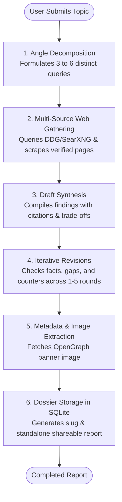

# Multi-Step Deep Research

Marnie features an autonomous, multi-turn Deep Research engine capable of conducting comprehensive investigations into complex technical questions, market trends, or scientific topics without external SaaS dependencies.

---

## 1. Research Lifecycle & Pipeline

1. **Angle Decomposition**:
   - The engine analyzes the user's research topic and uses an LLM to generate 3 to 6 targeted, distinct investigative angles (e.g., historical context, current state-of-the-art, benchmark results, security risks).
2. **Multi-Source Gathering**:
   - Queries are dispatched across DuckDuckGo or SearXNG.
   - For every promising URL found, the engine fetches and extracts body text using a lightweight Cheerio HTML scraper.
3. **Draft Synthesis**:
   - Gathers all extracted text and constructs a comprehensive initial draft report containing an Executive Summary, Key Findings, Technical Comparison, and Citations.
4. **Iterative Revision Rounds**:
   - Runs configurable revision loops (`min_revisions` to `max_revisions`, typically 1 to 3 passes).
   - Identifies remaining blind spots, queries additional evidence, and expands weak sections.
5. **Image & Metadata Enrichment**:
   - Automatically inspects cited URLs for OpenGraph/Twitter card images (`og:image`) to generate a visual cover image for the report.
6. **Shareable Reports & Persistent Storage**:
   - Saves the final report to the `deep_researches` SQLite table and generates a slug for direct link access (e.g., `/reports/my-topic-slug`).

---

## 2. Key Features

- **Real-Time Execution Logs**: The UI streams live status updates (current query, URLs analyzed, drafting phase, revision count).
- **Graceful Cancellation**: Active research runs can be canceled mid-flight via `POST /api/research/:id/cancel`.
- **Integrated Markdown, Math & Diagrams**: Deep research reports render full GitHub-flavored markdown, LaTeX math formulas via KaTeX, and Mermaid architecture diagrams.
- **Standalone Report Links**: Reports can be viewed through the in-app viewer or directly accessed as clean, read-only standalone documents.

---

## 3. Database Schema

The `deep_researches` table tracks complete run state:

| Column | Type | Description |
| :--- | :--- | :--- |
| `id` | `TEXT PRIMARY KEY` | UUIDv4 identifier |
| `topic` | `TEXT` | User's research prompt or question |
| `status` | `TEXT` | `pending`, `in_progress`, `completed`, `failed`, `cancelled` |
| `model` | `TEXT` | LLM model employed for the run |
| `rounds` | `INTEGER` | Number of completed revision rounds |
| `queries` | `INTEGER` | Total search queries executed |
| `urls_analyzed` | `INTEGER` | Count of scraped and evaluated webpages |
| `summary` | `TEXT` | Executive summary of findings |
| `report` | `TEXT` | Full markdown research dossier |
| `logs` | `TEXT` | JSON array of timestamped step logs |
| `sources` | `TEXT` | JSON array of cited sources `{ title, url, snippet }` |
| `image` | `TEXT` | Banner cover image URL extracted from sources |
| `slug` | `TEXT` | URL-safe title slug for direct link sharing |
| `duration` | `TEXT` | Human-readable runtime (e.g., "1m 42s") |
