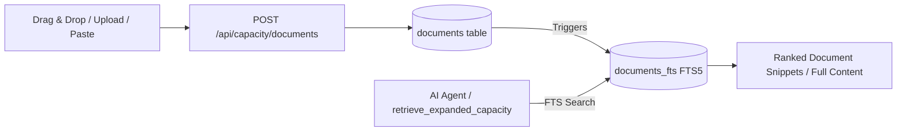

# Expanded Capacity (Local RAG)

Expanded Capacity is Marnie's built-in, Gemini NotebookLM-style local Retrieval-Augmented Generation (RAG) system. It enables users to store large collections of reference documents, specifications, and notes in an embedded SQLite database with sub-millisecond full-text search indexing.

---

## 1. Core Architecture

- **Dedicated Storage**: Operates on an isolated database at `./data/capacity.db` (configured via `CAPACITY_DB_PATH`), distinct from the primary conversation database.
- **SQLite FTS5 Virtual Table**: All indexed documents are synchronized in real time with an SQLite `fts5` virtual table (`documents_fts`) using automatic database triggers (`AFTER INSERT`, `AFTER DELETE`, `AFTER UPDATE`).
- **High Concurrency**: Uses Write-Ahead Logging (`WAL` mode) and synchronous normal mode for fast reads without blocking writes.



---

## 2. Key Capabilities

1. **Drag-and-Drop & File Picker**:
   - Supports Markdown (`.md`) and plain text (`.txt`) documents.
   - Drag files directly over the browser window to open the upload dialogue.
   - Interactive file picker for batch multi-file uploads.
2. **Snippet / Copied Text Modal**:
   - Allows pasting raw text or clipboard notes directly into a new document card with custom categorization.
3. **Card-Based UI**:
   - Displays reference documents as responsive cards with metadata badges:
     - Document type badge (`< >` for Markdown, text document icon for Plain Text).
     - File size in KB/MB.
     - Total word count.
     - Upload and update timestamps.
4. **Read-Only Fullscreen Preview Modal**:
   - Inspect document text without modifying the original knowledge source.
5. **Agent Integration (`retrieve_expanded_capacity`)**:
   - The AI agent can query the knowledge base during conversation turns to extract facts, verify specifications, or cite documentation.

---

## 3. Database Schema

```sql
CREATE TABLE IF NOT EXISTS documents (
  id          TEXT PRIMARY KEY,
  name        TEXT NOT NULL,
  content     TEXT NOT NULL,
  size        INTEGER NOT NULL,
  type        TEXT NOT NULL,
  category    TEXT DEFAULT 'General',
  word_count  INTEGER DEFAULT 0,
  created_at  INTEGER NOT NULL DEFAULT (strftime('%s','now')),
  updated_at  INTEGER NOT NULL DEFAULT (strftime('%s','now'))
);

CREATE VIRTUAL TABLE IF NOT EXISTS documents_fts USING fts5(
  name,
  content,
  content='documents',
  content_rowid='rowid'
);
```

---

## 4. API Endpoints

- `GET /api/capacity/documents`: List all stored reference documents with word counts and 200-character snippets.
- `GET /api/capacity/documents/:id`: Fetch complete document metadata and text content.
- `POST /api/capacity/documents`: Upload one or multiple documents (`{ name, content, type, category }` or multipart payload).
- `DELETE /api/capacity/documents/:id`: Remove a document from both the base table and FTS index.
- `GET /api/capacity/search?q=:query`: Perform full-text search across all indexed document names and text.
