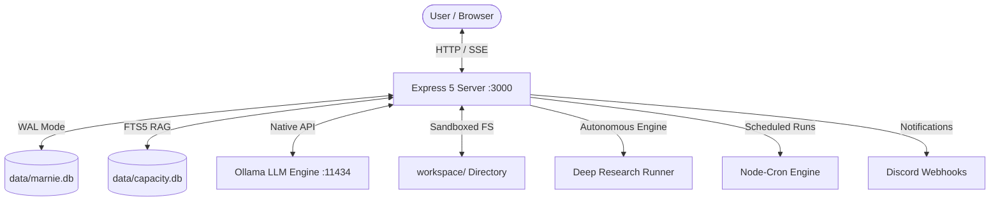

# Marnie Architecture & Features Overview

Marnie is a self-hosted, all-in-one local AI workspace designed for privacy, local LLM execution, autonomous agentic workflows, and tool execution with zero external microservices required.

---

## 1. High-Level Architecture

Marnie operates as a full-stack system consisting of:
- **Core Server (Node.js & Express 5)**: Hosts REST endpoints, Server-Sent Events (SSE) streaming, database connections, and background automation loops.
- **Embedded Database Engine (better-sqlite3)**: High-performance SQLite storage running in Write-Ahead Logging (WAL) mode for message history, background tasks, cron schedules, research reports, and local RAG.
- **Single Page Application Frontend (React 18 & Vite)**: Clean, responsive user interface featuring conversation branching, live streaming Markdown rendering, interactive artifact preview panels, and modal management.
- **Local Model Provider Integration (Ollama)**: Communicates directly with local LLMs (e.g., Llama 3, Mistral, Qwen 2.5, DeepSeek) through Ollama's HTTP API, with native function calling and fallback prompt parsing.

---

## 2. Core Feature Matrix

| Feature | Description | Primary Location |
| :--- | :--- | :--- |
| **Brain Memory** | Persistent memory in `workspace/BRAIN.md`, auto-consolidated every 5 turns by LLM. | `src/components/tools/brainMemory.js` |
| **Notes** | Persistent working notebook in `workspace/NOTES.md` with on-demand retrieval and checklists. | `src/components/tools/notesManager.js` |
| **Expanded Capacity (Local RAG)** | Gemini Notebook-style document knowledge base using SQLite FTS5 full-text indexing. | `src/db/capacity.js` |
| **Multi-Step Deep Research** | Autonomous multi-turn web investigation, source scraping, draft synthesis, and revision rounds. | `src/components/tools/deepResearchEngine.js` |
| **Artifacts Panel** | Claude-style live preview and editor for HTML, CSS, JavaScript, SVG, Markdown, LaTeX, and Mermaid. | `frontend/src/components/ArtifactPanel.jsx` |
| **Chat & Slash Commands** | Streaming chat interface supporting `/elim5`, `/btw`, `/fork`, `/title`, `/compact`, and `/output-style`. | `src/api/routes/chat.js` |
| **Task Management** | Persistent SQLite task tracker with priority ratings and state transitions. | `src/components/tools/tasks.js` |
| **Cron Scheduling** | Autonomous background job scheduler triggering Bash, Discord, or HTTP webhook actions. | `src/components/tools/cronManager.js` |
| **Discord Alerts** | Instant webhook notifications with rich embeds, colors, and severity levels. | `src/components/tools/discord.js` |
| **Native Tool Execution** | Linux shell execution, sandboxed JS runner, filesystem searches, web searches, and scraping. | `src/components/tools/registry.js` |

---

## 3. Workspace Boundary & Security Guardrails

Marnie enforces strict confinement to prevent agentic actions from harming host systems or corrupting the application source code:
- **Workspace Directory Confinement**: All file creation (`create_file`), file writing (`write_file`), file deletion, and direct raw previews are strictly jailed inside `/workspace`.
- **Path Resolution Checks**: The utility `src/utils/workspace.js` evaluates relative and canonical paths using `path.resolve` and verifies they do not escape `WORKSPACE_DIR` via directory traversal (`../`).
- **Read Path Safeguards**: Reading local files (`read_file`) permits reading within the workspace or safe project reference files, but strictly disallows accessing arbitrary host system directories (such as `/etc/` or `/root/`).
- **Zero-Emoji Policy**: Enforces a professional, clean technical tone across system prompts, alerts, and tool outputs.
